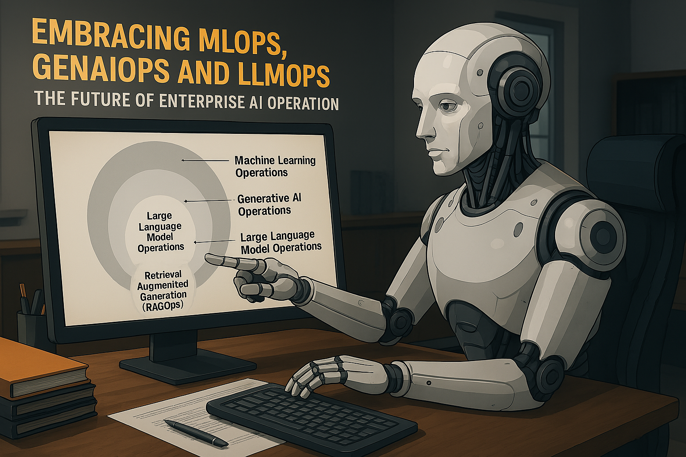
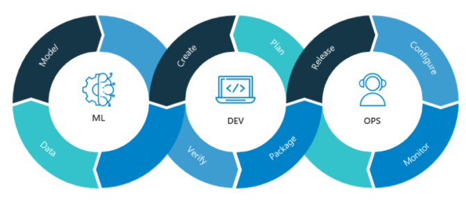
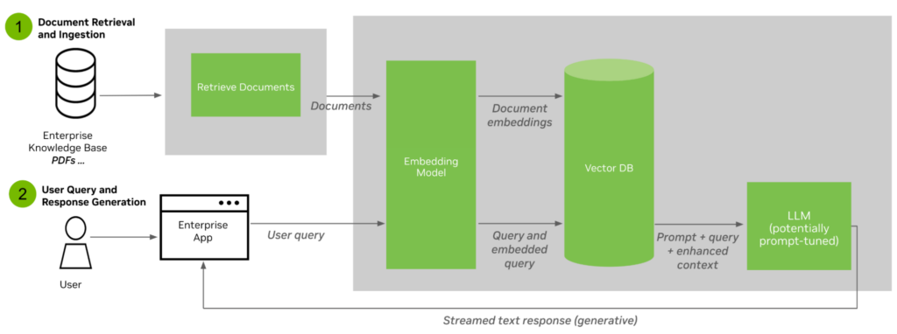
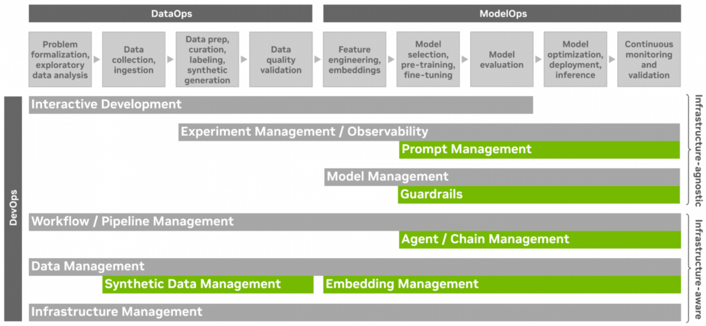

# 🚀 Embracing MLOps, GenAIOps, and LLMOps: The Future of Enterprise AI Operations

Businesses today increasingly rely on data and AI to innovate, deliver value to customers, and maintain competitive advantage. The rapid adoption of machine learning (ML) has created a demand for specialized tools, processes, and organizational frameworks that ensure models and applications operate reliably, cost-effectively, and at scale—this is known broadly as **Machine Learning Operations (MLOps)**.

With the advent of generative AI and large language models (LLMs), specialized areas such as **Generative AI Operations (GenAIOps)** and **Large Language Model Operations (LLMOps)** have emerged. These new operational paradigms address unique challenges in managing generative AI and LLM-powered applications in production environments.

---

## 🌟 Understanding MLOps, GenAIOps, LLMOps, and RAGOps

AI operations can be viewed as nested layers:

- **MLOps** provides foundational practices for developing, deploying, managing, and monitoring ML models, ensuring reliable, efficient, and scalable production environments.

- **GenAIOps** builds upon MLOps to operationalize generative AI solutions, emphasizing management and customization of foundation models.
- **LLMOps** is a specific subset of GenAIOps, dedicated to deploying and managing applications powered specifically by large language models.
- **RAGOps (Retrieval-Augmented Generation Operations)** further specializes in applications combining LLMs with external knowledge databases to ensure model outputs are accurate and current without frequent retraining.

---

## 🎯 The Generative AI Development Journey

The lifecycle of modern generative AI applications involves several crucial stages:

1. **Foundation Model Alignment**: Pretraining models with extensive data to grasp foundational knowledge, then aligning them with human behaviors and values through fine-tuning.
2. **Customization**: Tailoring models to specific tasks or datasets relevant to enterprise needs.
3. **Retrieval Augmented Generation (RAG)**: Integrating models with external knowledge to maintain accuracy and freshness of information during query time.
4. **Operational Deployment**: Ensuring robust deployment, real-time evaluation, security, and scalability.
5. **Continuous Feedback**: Establishing feedback loops from user interactions to continuously refine and enhance model performance.

---
## ⚠️ Common Pitfalls in Enterprise AI Adoption

- While the excitement around LLMs and generative AI is justified, many enterprises fall into the trap of rapid adoption without proper operational foundations like MLOps or LLMOps. This often leads to cost overruns, scalability bottlenecks, security vulnerabilities, and ethical missteps due to lack of governance. Without robust monitoring, feedback loops, and infrastructure in place, organizations risk deploying models that are brittle, biased, or unable to adapt to real-world usage. Taking a strategic, operations-first approach helps avoid these pitfalls and ensures AI solutions are not only innovative—but also reliable, secure, and sustainable.

## ⚙️ Capabilities and Advantages of MLOps and GenAIOps

### MLOps Capabilities:
- **Infrastructure Management**: Automating provisioning and management of compute resources.
- **Data Management**: Ensuring data quality, consistency, and traceability.
- **Model Management**: Version control, model lifecycle tracking, and risk assessment.
- **Experiment Management**: Facilitating experimentation, hyperparameter tuning, and performance monitoring.

### GenAIOps Enhanced Capabilities:
- **Synthetic Data Management**: Generating synthetic datasets for training and validation.
- **Embedding Management**: Efficient handling and retrieval of embedding vectors through vector databases.
- **Agent & Chain Management**: Managing complex interactions across multiple AI models.
- **Guardrails**: Ensuring outputs adhere to safety, security, and ethical guidelines.
- **Prompt Management**: Developing, optimizing, and managing prompts for consistent high-quality outputs.

---

## 📈 Business Benefits of MLOps, GenAIOps, and LLMOps

Adopting these operational strategies offers numerous benefits:

- **Faster Time-to-Market**: Streamlining and automating workflows accelerates innovation cycles.
- **Innovation and Yield Improvement**: Increased experimental throughput and broader developer engagement.
- **Risk Mitigation**: Proactively managing ethical and operational risks.
- **Streamlined Collaboration**: Enhancing teamwork and knowledge sharing across multiple teams.
- **Lean Operations and Cost Efficiency**: Resource optimization leading to reduced total cost of ownership.
- **Reproducibility**: Ensuring compliance through consistent and repeatable outcomes.

---

## 💡 The Transformational Potential of MLOps and GenAIOps

Integrating these operational frameworks significantly enhances:

- **User Experience**: Providing advanced AI-powered interactions through chatbots, autonomous agents, and content generation.
- **New Revenue Streams**: Unlocking new applications and business opportunities.
- **Ethical Leadership**: Positioning enterprises as industry leaders through proactive management of AI ethics and biases.

As generative AI continues to evolve, mastering MLOps, GenAIOps, and LLMOps becomes critical for organizations aiming to lead in the AI-driven future.

---

Join us in transforming enterprise AI through effective operational strategies that harness the full potential of generative AI.

